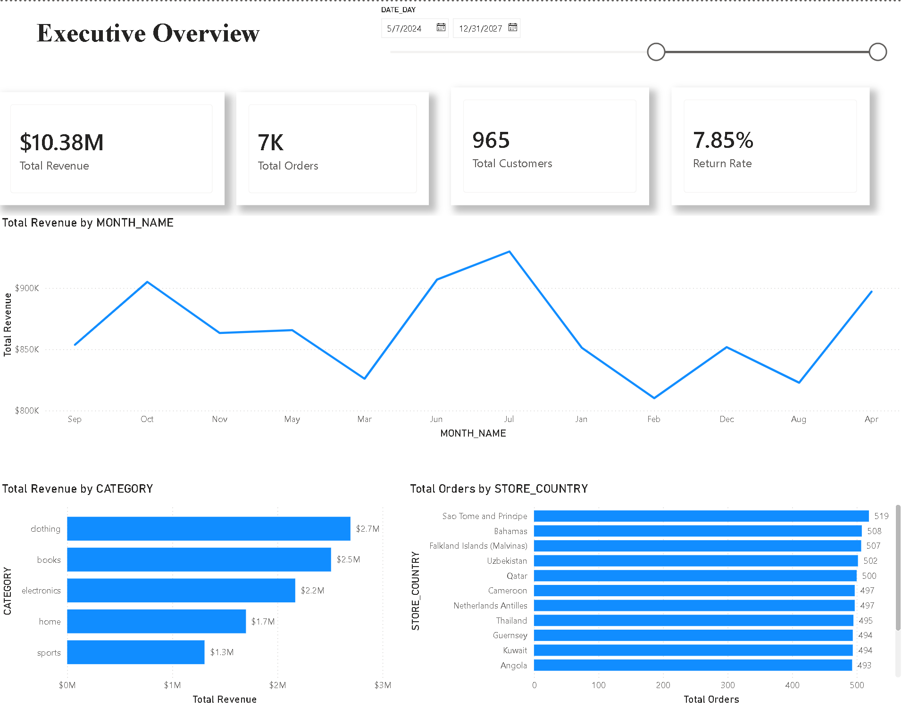
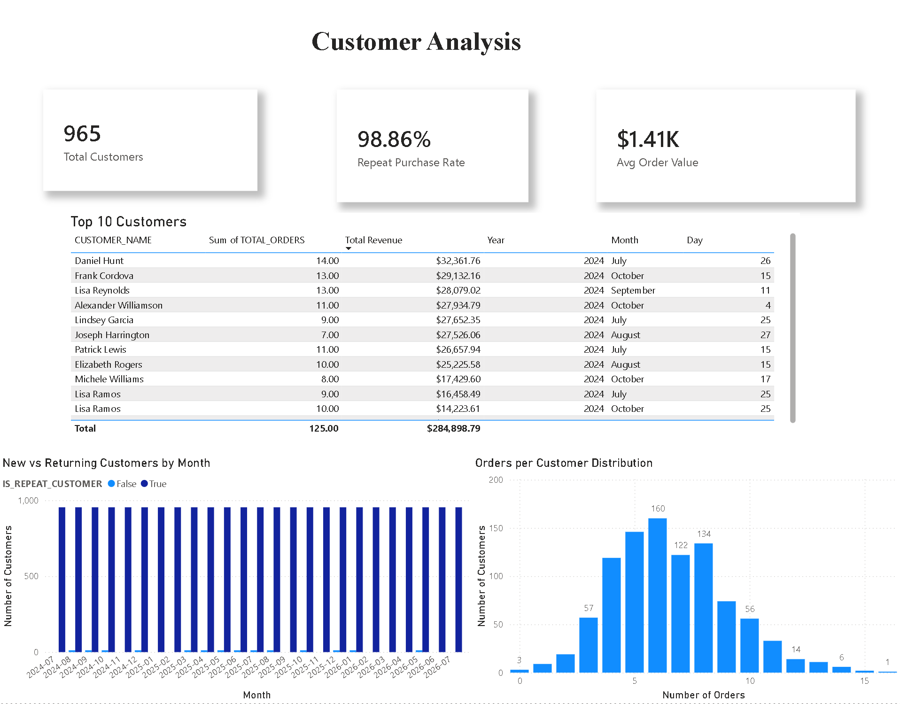
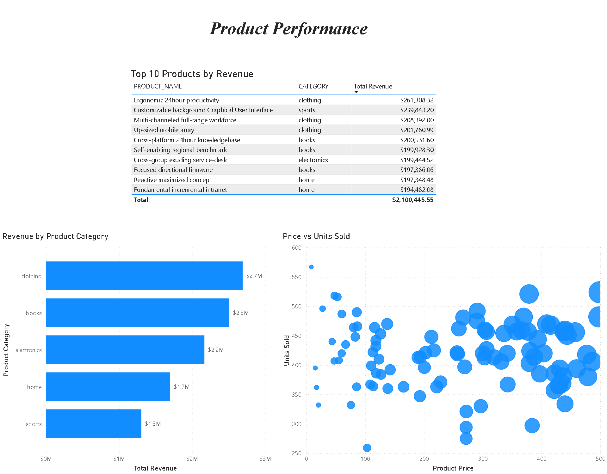
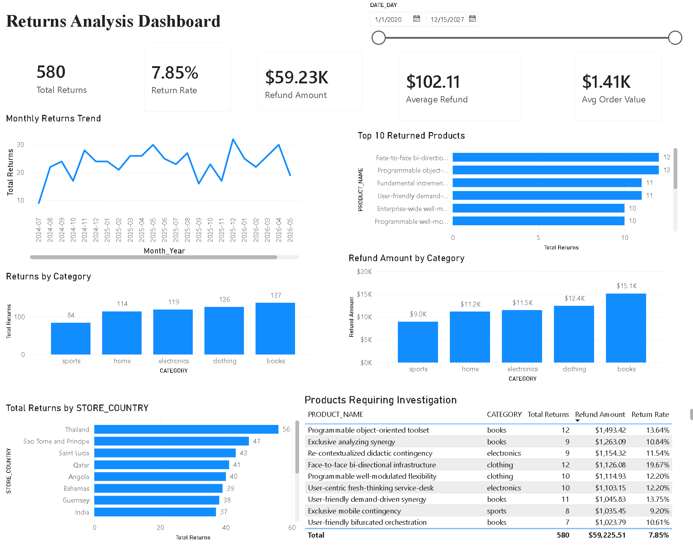
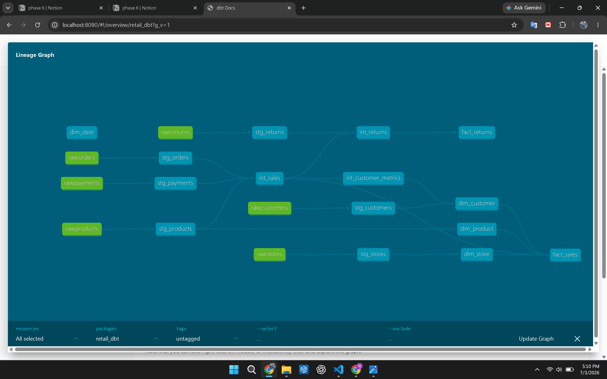
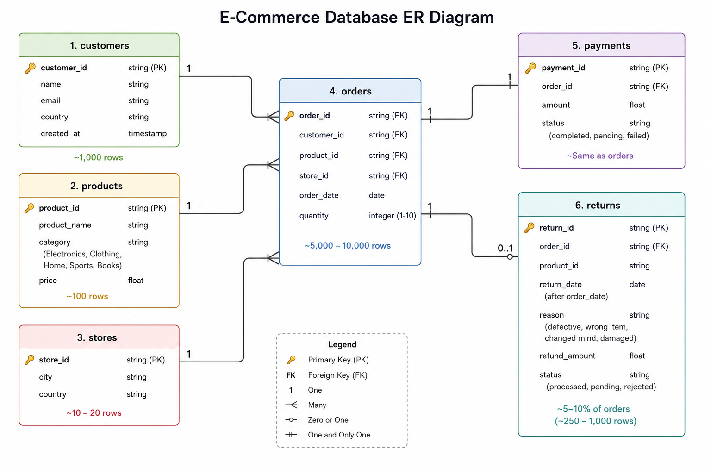

# 🏗️ Retail Analytics Data Warehouse

<p align="center">


</p>

<p align="center">

An end-to-end Data Engineering project that simulates a real-world retail analytics platform using **Python, AWS S3, Snowflake, dbt, SQL, and Power BI**.

The project demonstrates how raw transactional data is transformed into a clean, analytics-ready warehouse that supports business intelligence reporting through interactive dashboards.

</p>

---

# 🚀 Project Summary

| Feature | Details |
|----------|----------|
| **Project Type** | End-to-End Data Engineering Pipeline |
| **Domain** | Retail Analytics |
| **Programming Language** | Python, SQL |
| **Cloud Storage** | AWS S3 |
| **Data Warehouse** | Snowflake |
| **Transformation Tool** | dbt |
| **Data Modeling** | Star Schema |
| **Visualization** | Power BI |
| **Dashboards** | 4 Interactive Reports |
| **Data Quality** | Validation, Standardization & Quarantine |
| **Observability** | Audit Logging & Anomaly Detection |
| **Pipeline Flow** | Python → AWS S3 → Snowflake → dbt → Power BI |

---

# 📖 Project Overview

Modern organizations collect massive amounts of transactional data every day...
# 🏛️ Solution Architecture

```
                   Synthetic Retail Data
                             │
                             ▼
                   Python Data Generation
                             │
                             ▼
                     AWS S3 (Raw Zone)
                             │
                             ▼
             Python Data Cleaning & Validation
                             │
                             ▼
                    AWS S3 (Clean Zone)
                             │
                             ▼
                     Snowflake RAW Layer
                             │
                             ▼
                    dbt Staging Models
                             │
                             ▼
                 dbt Intermediate Models
                             │
                             ▼
                     dbt MARTS Layer
                             │
                             ▼
                 Power BI Interactive Reports

                             │
                             ▼
              Business Insights & Decision Making
```

---

# ⚙️ Technology Stack

| Category | Technology |
|-----------|------------|
| Programming Language | Python |
| Data Generation | Faker |
| Cloud Storage | AWS S3 |
| Data Warehouse | Snowflake |
| Data Transformation | dbt |
| Query Language | SQL |
| Data Modeling | Star Schema |
| Data Visualization | Power BI |
| Version Control | Git |
| Repository Hosting | GitHub |

---

# ✨ Key Features

## 🔹 Synthetic Retail Data Generation

Realistic retail datasets were generated using Python and Faker, including intentional data quality issues to simulate production environments.

---

## 🔹 Cloud-Based Data Lake

AWS S3 is used to separate the pipeline into:

- Raw Zone
- Clean Zone

This mirrors common lakehouse ingestion patterns.

---

## 🔹 Automated Data Quality Validation

Python validation checks include:

- Missing values
- Duplicate records
- Foreign key validation
- Invalid dates
- Category standardization

Invalid records are quarantined instead of being silently removed.

---

## 🔹 Snowflake Data Warehouse

Clean datasets are loaded into Snowflake where they serve as the foundation for analytical transformations.

Warehouse layers include:

- RAW
- STAGING
- MARTS
- AUDIT

---

## 🔹 dbt Transformation Pipeline

dbt is used to build layered SQL transformations that convert raw transactional data into analytics-ready dimensional models.

The project follows the standard transformation pattern:

```
RAW
   ↓
STAGING
   ↓
INTERMEDIATE
   ↓
MARTS
```

---

## 🔹 Audit & Observability

The pipeline includes validation checks to verify:

- Row counts
- Load status
- Pipeline execution
- Basic anomaly detection

These checks help ensure data reliability throughout the pipeline.

---

## 🔹 Interactive Power BI Dashboards

The final MART tables are connected to Power BI to provide business-ready reporting across four dashboard pages:

- Executive Overview
- Customer Analysis
- Product Performance
- Returns Analysis

These dashboards validate that the transformed warehouse supports real business reporting requirements.

---
# 📸 Dashboard Preview

## Executive Overview



---

## Customer Analysis



---

## Product Performance



---

## Returns Analysis



# 📌 Project Highlights

✅ End-to-End Data Engineering Pipeline

✅ Automated Data Quality Checks

✅ Cloud Storage using AWS S3

✅ Snowflake Data Warehouse

✅ dbt Layered Transformations

✅ Star Schema Data Model

✅ Audit & Observability Layer

✅ Interactive Power BI Dashboards

✅ GitHub Portfolio Documentation

---


---

# 📂 Repository Structure

```text
retail-analytics-warehouse/
│
├── data/
│   ├── raw/
│   ├── clean/
│   └── quarantine/
│
├── scripts/
│   ├── generate_data.py
│   ├── upload_to_s3.py
│   ├── clean_data.py
│   └── audit_pipeline.py
│
├── snowflake/
│   ├── setup.sql
│   ├── load_tables.sql
│   └── anomaly_checks/
│
├── dbt_project/
│   ├── models/
│   │   ├── staging/
│   │   ├── intermediate/
│   │   └── marts/
│   └── ...
│
├── dashboards/
│   ├── retail_analytics.pbix
│   └── screenshots/
│
├── docs/
│
├── incident_log/
│
├── requirements.txt
│
└── README.md
```

---

# 🔄 End-to-End Data Pipeline

The project follows a layered architecture commonly used in modern data engineering environments.

Each layer has a single responsibility, making the pipeline easier to understand, maintain, and scale.

```
Synthetic Data
      │
      ▼
Python ETL
      │
      ▼
AWS S3 (Raw)
      │
      ▼
Python Data Quality Layer
      │
      ▼
AWS S3 (Clean)
      │
      ▼
Snowflake RAW
      │
      ▼
dbt STAGING
      │
      ▼
dbt INTERMEDIATE
      │
      ▼
dbt MARTS
      │
      ▼
Power BI
```

This layered approach keeps raw data unchanged while producing trusted, analytics-ready datasets for reporting.

---

# 🧪 Synthetic Data Generation

To simulate a real retail business, synthetic datasets were generated using **Python** and the **Faker** library.

The pipeline creates multiple related datasets that resemble a transactional retail system.

### Generated Tables

| Table | Description |
|--------|-------------|
| Customers | Customer information |
| Products | Product catalog |
| Orders | Customer purchases |
| Payments | Payment transactions |
| Returns | Product returns and refunds |
| Stores | Store locations |

Relationships between these datasets allow the warehouse to model real business scenarios such as customer purchasing behavior, product performance, and return analysis.

---

# ⚠️ Simulated Data Quality Issues

Real-world data is rarely perfect.

To make the project more realistic, controlled data quality issues were intentionally introduced into the generated datasets.

The pipeline includes examples of:

- Missing values
- Duplicate records
- Foreign key violations
- Invalid dates
- Inconsistent category formatting

These issues provide realistic input for the validation and cleaning stages of the pipeline.

---

# 🛡️ Data Quality Strategy

Before data enters the warehouse, every dataset passes through a dedicated validation layer built in Python.

The cleaning process follows four key principles:

### ✅ Validate

Each dataset is checked against business and technical validation rules.

Examples include:

- Required fields
- Duplicate detection
- Foreign key validation
- Date validation
- Data type consistency

---

### ✅ Standardize

Safe formatting improvements are applied automatically.

Examples:

- Trim extra whitespace
- Normalize category names
- Standardize date formats

---

### ✅ Quarantine

Records that fail validation are separated into quarantine files instead of being silently deleted.

This preserves invalid records for investigation while ensuring only trusted data moves downstream.

---

### ✅ Produce Clean Data

Only validated records are exported into the clean layer and loaded into the warehouse.

This approach improves reliability while maintaining transparency over data quality issues.

---

# ☁️ AWS S3 Data Lake

AWS S3 acts as the landing zone for the pipeline.

The storage is logically separated into two layers.

## Raw Zone

Contains original generated datasets before validation.

The raw layer remains unchanged and serves as the source of truth.

---

## Clean Zone

Contains validated and standardized datasets produced by the Python cleaning process.

Only clean datasets are loaded into Snowflake.

This separation mirrors common lakehouse ingestion patterns used in production environments.

---

# ❄️ Snowflake Data Warehouse

Clean datasets are loaded into Snowflake where they become the foundation for analytics.

The warehouse is organized into multiple logical schemas.

| Schema | Purpose |
|---------|----------|
| RAW | Landing tables |
| STAGING | Standardized source models |
| MARTS | Analytics-ready business models |
| AUDIT | Pipeline monitoring |

This layered design separates ingestion, transformation, analytics, and monitoring responsibilities.

---

# 🔄 dbt Transformation Layers

dbt is used to transform raw warehouse tables into clean analytical models.

The transformation flow follows a standard layered architecture.

```
RAW
   │
   ▼
STAGING
   │
   ▼
INTERMEDIATE
   │
   ▼
MARTS
```

---
### dbt Model Lineage

The following lineage graph shows how raw tables are transformed through staging, intermediate, and mart models.



## Staging Layer

The staging layer performs lightweight transformations such as:

- Column renaming
- Data type casting
- Naming standardization
- Basic deduplication

This layer keeps the models close to the original source while improving consistency.

---

## Intermediate Layer

The intermediate layer combines datasets and applies business logic.

Examples include:

- Sales calculations
- Return calculations
- Customer metrics
- Revenue calculations

---

## Mart Layer

The mart layer provides business-ready tables optimized for reporting.

The project includes:

### Dimension Tables

- dim_customer
- dim_product
- dim_store
- dim_date

### Fact Tables

- fact_sales
- fact_returns

These tables follow a Star Schema design, allowing Power BI to perform efficient analytical queries.

---

# ⭐ Star Schema

```
                 dim_customer
                      │
                      │
dim_product ─── fact_sales ─── dim_store
                      │
                      │
                  dim_date

                      │

                fact_returns
```

The Star Schema separates descriptive attributes into dimension tables while storing measurable business events inside fact tables.

This design improves query performance and simplifies business reporting.

---

### Entity Relationship Diagram



---

# 📊 Audit & Observability

Building a pipeline is only part of the job. A reliable pipeline should also verify that data has been loaded correctly and provide visibility into pipeline health.

This project includes a lightweight audit layer to monitor data movement and validate successful execution.

## Audit Checks

The pipeline performs checks such as:

- Row count validation
- Data load verification
- Pipeline execution status
- Data quality summary generation

These checks help detect issues early and improve confidence in downstream analytics.

---

## Data Quality Reporting

During the cleaning process, a data quality report is generated to summarize validation results for each dataset.

Typical metrics include:

- Total records processed
- Valid records
- Quarantined records
- Validation failures by rule

This provides visibility into overall data quality before data enters the warehouse.

---

## Anomaly Detection

The project also demonstrates simple business-level anomaly detection using SQL.

Examples include:

- Significant month-over-month revenue drops
- Unusual increases in return rates
- High payment failure rates

These checks illustrate how data pipelines can support operational monitoring in addition to reporting.

---

# 📈 Power BI Dashboards

The curated MART tables are connected to Power BI to provide business-ready reporting.

The report consists of four interactive dashboard pages.

---

## 📌 Executive Overview

Provides a high-level summary of business performance.

### KPIs

- Total Revenue
- Total Orders
- Total Customers
- Return Rate

### Visuals

- Monthly Revenue Trend
- Revenue by Product Category
- Revenue by Country

**Screenshot**

> Replace with:

```text
dashboards/screenshots/executive_overview.png
```

---

## 👥 Customer Analysis

Focuses on customer purchasing behavior.

### KPIs

- Total Customers
- Repeat Purchase Rate
- Average Order Value

### Visuals

- Top Customers
- New vs Returning Customers
- Customer Purchase Distribution

**Screenshot**

> Replace with:

```text
dashboards/screenshots/customer_analysis.png
```

---

## 📦 Product Performance

Provides insights into product sales performance.

### Visuals

- Top Products by Revenue
- Revenue by Category
- Product Price vs Units Sold

**Screenshot**

> Replace with:

```text
dashboards/screenshots/product_performance.png
```

---

## 🔄 Returns Analysis

The Returns Analysis dashboard focuses on product returns and refund trends.

### KPIs

- Total Returns
- Return Rate
- Total Refund Amount
- Refund Percentage of Revenue

### Visuals

- Return Rate by Category
- Refund Trend
- Return Reasons
- Products with Highest Return Rate

This dashboard demonstrates how business users can identify products generating excessive refunds and investigate potential quality issues.

**Screenshot**

> Replace with:

```text
dashboards/screenshots/returns_analysis.png
```

---

# 💡 Business Insights

Although the datasets are synthetically generated, the warehouse enables business users to answer common analytical questions.

Examples include:

- Which product categories generate the highest revenue?
- Which customers contribute the most revenue?
- Which products have unusually high return rates?
- How are monthly sales changing over time?
- What percentage of revenue is lost through refunds?

These insights demonstrate the practical value of building a structured analytical warehouse.

---

# 🚀 How to Run the Project

## 1. Clone the Repository

```bash
git clone https://github.com/<your-username>/retail-analytics-warehouse.git
```

---

## 2. Create a Virtual Environment

```bash
python -m venv venv
```

Activate the environment.

### Windows

```bash
venv\Scripts\activate
```

### Linux / macOS

```bash
source venv/bin/activate
```

---

## 3. Install Dependencies

```bash
pip install -r requirements.txt
```

---

## 4. Configure Environment Variables

Create a `.env` file and provide the required AWS and Snowflake credentials.

Example variables include:

```text
AWS_ACCESS_KEY_ID=
AWS_SECRET_ACCESS_KEY=
AWS_REGION=

SNOWFLAKE_ACCOUNT=
SNOWFLAKE_USER=
SNOWFLAKE_PASSWORD=
SNOWFLAKE_DATABASE=
SNOWFLAKE_WAREHOUSE=
```

---

## 5. Execute the Pipeline

Run the pipeline in the following order:

1. Generate synthetic retail data
2. Upload raw datasets to AWS S3
3. Perform data validation and cleaning
4. Upload clean datasets
5. Load data into Snowflake
6. Execute dbt transformations
7. Run audit checks
8. Open the Power BI report

---

## Repository Outputs

After a successful execution, the project produces:

- Clean datasets
- Snowflake warehouse tables
- dbt models
- Audit reports
- Interactive Power BI dashboards

---


---

# 🎯 Project Achievements

This project demonstrates the complete lifecycle of building a modern analytical data warehouse.

### Successfully Implemented

- ✅ Synthetic retail data generation using Python
- ✅ Automated data validation and cleaning
- ✅ AWS S3 Raw and Clean storage zones
- ✅ Snowflake data warehouse
- ✅ Layered dbt transformations
- ✅ Star Schema dimensional modeling
- ✅ Audit logging and pipeline validation
- ✅ Basic anomaly detection
- ✅ Interactive Power BI dashboards
- ✅ End-to-end project documentation

---

# 🧠 Skills Demonstrated

This project allowed me to gain practical experience across multiple areas of Data Engineering.

### Data Engineering

- ETL / ELT Pipeline Design
- Data Validation
- Data Cleaning
- Data Warehousing
- Data Modeling
- Star Schema Design

### Programming

- Python
- SQL

### Cloud Technologies

- AWS S3
- Snowflake

### Analytics Engineering

- dbt
- SQL Transformations
- Data Testing

### Business Intelligence

- Power BI
- DAX
- Dashboard Design

### Development Tools

- Git
- GitHub
- VS Code

---

# 📚 Lessons Learned

Building this project provided valuable hands-on experience beyond writing SQL queries.

Some of the key lessons learned include:

- Designing pipelines with clear separation of responsibilities.
- Understanding the importance of data quality before loading data into a warehouse.
- Building layered transformations using dbt.
- Designing dimensional models that support analytical reporting.
- Validating pipelines through audit checks instead of assuming successful execution.
- Creating dashboards that communicate business insights rather than simply displaying charts.
- Documenting engineering decisions for maintainability and collaboration.

---

# 🚀 Future Improvements

Although the project is complete, several enhancements could make it even closer to a production environment.

Potential future improvements include:

- Apache Airflow workflow orchestration
- Snowpipe for automated ingestion
- Incremental dbt models
- Great Expectations for advanced data quality testing
- Docker containerization
- CI/CD pipeline using GitHub Actions
- Infrastructure as Code using Terraform
- Real-time streaming with Apache Kafka
- Data catalog and metadata management
- Unit testing for Python ETL scripts

---

# 📸 Project Gallery

The repository contains screenshots of all Power BI dashboards.

| Dashboard | Description |
|-----------|-------------|
| Executive Overview | Business KPIs and revenue trends |
| Customer Analysis | Customer behavior and repeat purchases |
| Product Performance | Product sales and category analysis |
| Returns Analysis | Refunds, returns, and product quality insights |

Dashboard images are available in:

```text
dashboards/screenshots/
```

---

# 📄 Documentation

The project includes supporting documentation and design artifacts to explain the pipeline architecture, data model, and transformation workflow.

## Architecture & Design

### Entity Relationship Diagram


---

### dbt Lineage Graph


---

### Pipeline Run Log

Pipeline execution history and validation logs are documented in:

```text
docs/pipeline_run_log.md
```

---

### Incident Logs

Debugging notes, issues encountered, and resolutions are documented in:

```text
incident_log/
```

# 🤝 Acknowledgements

This project was built as part of my Data Engineering learning journey to gain practical experience with modern cloud-based data platforms and analytics engineering tools.

Special thanks to the open-source communities behind:

- Python
- AWS
- Snowflake
- dbt
- Power BI

whose documentation and tools make projects like this possible.

---

# 👨‍💻 Author

**Sufian Aslam**

Data Engineer | Python | SQL | Snowflake | dbt | AWS | Power BI

GitHub: https://github.com/SufianNuml

LinkedIn: https://www.linkedin.com/in/sufian-aslam-08591324b/

> Replace the links above with your actual GitHub and LinkedIn profile URLs.

---

# ⭐ Support

If you found this project helpful or interesting, consider giving the repository a ⭐ on GitHub.

Feedback, suggestions, and contributions are always welcome.

---

## Thank You!

Thank you for taking the time to explore this project.

I hope it demonstrates not only my technical skills but also my approach to building reliable, maintainable, and well-documented data engineering solutions.